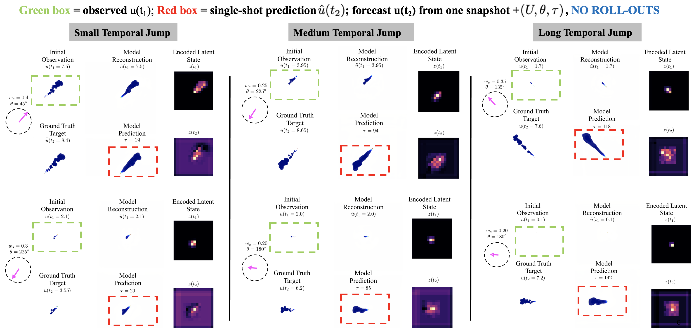
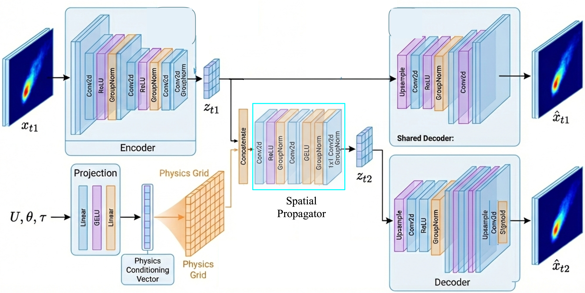

# ConvLEO: Wind-Conditioned Plume Forecasting

ConvLEO is a convolutional extension of the **Latent Evolution Operator (LEO)** for wind-conditioned plume forecasting.

Given a single observed plume snapshot \(u(x,y,t)\), wind speed \(U\), wind direction \(\theta\), and a user-specified time jump \(\tau\), ConvLEO predicts the future plume field

\[
\hat{u}(x,y,t+\tau)
\]

in one shot, without autoregressive rollout.

## Core Idea

Most spatiotemporal forecasting models require step-by-step rollout from past frames. ConvLEO instead learns a latent state-to-state map:

\[
u(t),\; [U,\sin(\theta),\cos(\theta),\tau]
\;\longrightarrow\;
\hat{u}(t+\tau).
\]

This allows arbitrary-time forecasts from a single observation time.

## Initial Results

Green boxes denote the observed input \(u(t_1)\). Red boxes denote the single-shot prediction \(\hat{u}(t_2)\). The model forecasts \(u(t_2)\) directly from one snapshot and the conditioning vector \((U,\theta,\tau)\), with **no rollout**.

## Model Architecture

ConvLEO uses spatial latent tensors and convolutional propagation instead of flattened latent vectors. Wind speed, wind direction, and time jump are projected into a spatial physics-conditioning tensor and injected into the latent propagator.

## Why ConvLEO?

- **Single-shot forecasting:** predicts \(u(t+\tau)\) directly.
- **No rollout drift:** avoids accumulated error from autoregressive prediction.
- **Wind-conditioned:** conditions on wind speed and wind direction.
- **Spatial latent structure:** preserves plume morphology better than flattened latent MLP propagation.
- **Sparse plume-aware training:** mask-weighted losses help avoid background-dominated collapse.

## Contents

- [`ConvLEO.pdf`](ConvLEO.pdf) — short project report describing the problem, model philosophy, and initial results.

## Problem Setup

- **Input:** observed plume field \(u(x,y,t)\), wind speed \(U\), wind direction \(\theta\), and time jump \(\tau\).
- **Output:** predicted plume field \(\hat{u}(x,y,t+\tau)\).
- **Conditioning vector:** \(\zeta = [U,\sin(\theta),\cos(\theta),\tau]\).

## Status

This repository is a work-in-progress project summary. The code is not included here while the implementation is being cleaned and extended.

## Author

Khalid Rafiq
